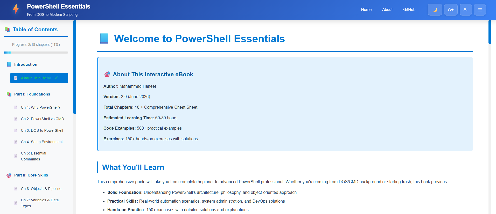
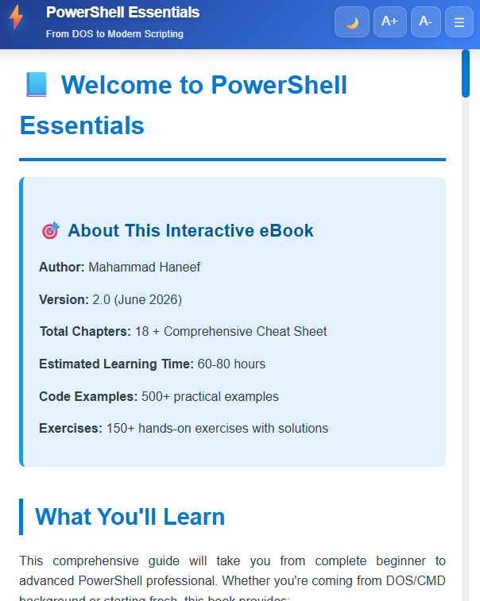
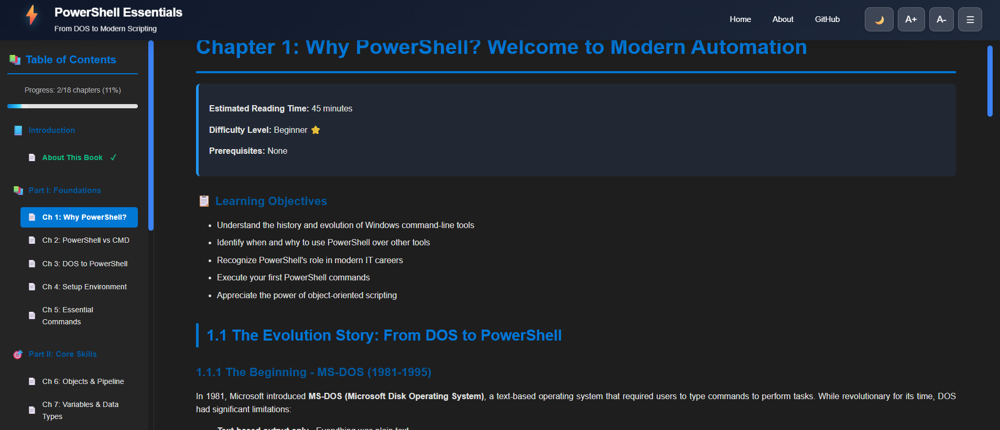

# 📚 PowerShell Essentials - Interactive eBook


> A modern, interactive, and comprehensive PowerShell learning platform with 18 chapters covering everything from basics to advanced scripting.

## 🌐 Live Demo

**[https://haneefputtur.com/books/power-shell](https://haneefputtur.com/books/power-shell)**

---

## ✨ Features

### 🎨 Modern UI/UX
- **Responsive Design** - Works seamlessly on desktop, tablet, and mobile
- **Dark Mode** - Eye-friendly theme with smooth transitions
- **Glass-morphism Effects** - Modern frosted glass design elements
- **Animated Header** - Floating logo with gradient backgrounds

### 📖 Learning Features
- **18 Comprehensive Chapters** - From basics to advanced topics
- **Interactive Code Blocks** - Copy-to-clipboard functionality
- **Chapter Quizzes** - Test your knowledge with interactive Q&A
- **Progress Tracking** - Automatic chapter completion tracking
- **Bookmarks** - Save your favorite chapters
- **Search Functionality** - Quick content search across all chapters

### ⚡ Performance
- **Fast Loading** - Optimized CSS and JavaScript
- **Local Storage** - Persistent user preferences and progress
- **Keyboard Shortcuts** - Power-user friendly navigation
- **Smooth Animations** - 60 FPS transitions

### 🔧 Technical Features
- **Deep Linking** - Shareable URLs for specific chapters
- **Browser Navigation** - Back/forward button support
- **Export/Import Progress** - Backup and restore your learning progress
- **Print Friendly** - Optimized for printing chapters

---

## 📋 Table of Contents

### Part 1: Foundations
1. **Introduction to PowerShell** - What is PowerShell and why use it
2. **Getting Started** - Installation and basic commands
3. **PowerShell Basics** - Cmdlets, syntax, and help system
4. **Working with Objects** - Understanding the PowerShell pipeline

### Part 2: Core Concepts
5. **Variables and Data Types** - Storing and manipulating data
6. **Operators** - Arithmetic, comparison, and logical operators
7. **Control Flow** - If statements, loops, and switches
8. **Functions** - Creating reusable code blocks

### Part 3: Advanced Topics
9. **Error Handling** - Try/catch and error management
10. **Modules** - Importing and creating modules
11. **Working with Files** - File system operations
12. **Remote Management** - PowerShell remoting

### Part 4: Practical Applications
13. **Active Directory** - Managing AD with PowerShell
14. **System Administration** - Common admin tasks
15. **Scripting Best Practices** - Writing maintainable code
16. **Advanced Scripting** - Complex scenarios and patterns

### Part 5: Mastery
17. **PowerShell 7+** - Modern PowerShell features
18. **Real-World Projects** - Practical automation examples

**Bonus:** PowerShell Cheat Sheet - Quick reference guide

---

## 🚀 Getting Started

### Prerequisites
- Modern web browser (Chrome, Firefox, Safari, Edge)
- No server required - runs entirely client-side
- JavaScript enabled

### Installation

1. **Clone the repository**
   ```bash
   git clone https://github.com/haneefputtur/PowerShell-Essentials.git
   cd PowerShell-Essentials
   ```

2. **Open locally**
   ```bash
   # Simply open index.html in your browser
   open index.html  # macOS
   start index.html # Windows
   xdg-open index.html # Linux
   ```

3. **Or serve with a local server**
   ```bash
   # Python 3
   python -m http.server 8000
   
   # Node.js
   npx serve
   
   # PHP
   php -S localhost:8000
   ```

4. **Access in browser**
   ```
   http://localhost:8000
   ```

---

## 📁 Project Structure

```
PowerShell-Essentials/
├── index.html          # Main HTML file with all chapters
├── haneef.css          # Styles and theme definitions
├── haneef.js           # JavaScript functionality
├── README.md           # This file
└── assets/             # (Optional) Images and resources
```

---

## ⌨️ Keyboard Shortcuts

| Shortcut | Action |
|----------|--------|
| `Ctrl + K` | Focus search |
| `Ctrl + D` | Toggle dark mode |
| `Ctrl + +` | Increase font size |
| `Ctrl + -` | Decrease font size |
| `→` | Next chapter |
| `←` | Previous chapter |

---

## 🎨 Customization

### Change Primary Color
Edit `:root` variables in `haneef.css`:

```css
:root {
    --primary-color: #0078D4;  /* Change this */
    --secondary-color: #106EBE;
    --accent-color: #50E6FF;
}
```

### Modify Sidebar Width
```css
.sidebar {
    width: 300px; /* Adjust as needed */
}
```

### Custom Fonts
```css
body {
    font-family: 'Your-Font', 'Segoe UI', sans-serif;
}
```

---

## 🔧 Configuration

### LocalStorage Keys
The app uses these localStorage keys:
- `completedChapters` - Array of completed chapter numbers
- `currentChapter` - Last viewed chapter
- `bookmarks` - Array of bookmarked chapters
- `darkMode` - Boolean for theme preference
- `fontSize` - User's preferred font size

### Reset Progress
```javascript
// Open browser console and run:
localStorage.clear();
location.reload();
```

---

## 🌟 Features in Detail

### Progress Tracking
- Automatically marks chapters as read after 3 seconds
- Visual checkmarks in sidebar for completed chapters
- Progress bar showing completion percentage
- Export/import functionality for backup

### Code Blocks
- Syntax highlighting for PowerShell code
- One-click copy to clipboard
- Professional styling with headers
- Toast notifications on copy

### Responsive Design
- Mobile-first approach
- Hamburger menu for mobile devices
- Touch-friendly buttons and controls
- Adaptive layout for all screen sizes

---

## 🤝 Contributing

Contributions are welcome! Here's how you can help:

1. **Fork the repository**
2. **Create a feature branch**
   ```bash
   git checkout -b feature/AmazingFeature
   ```
3. **Commit your changes**
   ```bash
   git commit -m 'Add some AmazingFeature'
   ```
4. **Push to the branch**
   ```bash
   git push origin feature/AmazingFeature
   ```
5. **Open a Pull Request**

### Contribution Ideas
- Add more chapters or topics
- Improve code examples
- Fix typos or errors
- Enhance UI/UX
- Add translations
- Create video tutorials

---

## 🐛 Bug Reports

Found a bug? Please open an issue with:
- Browser and version
- Steps to reproduce
- Expected vs actual behavior
- Screenshots (if applicable)

---

## 📝 License

This project is licensed under the MIT License - see the [LICENSE](LICENSE) file for details.

```
MIT License

Copyright (c) 2026 Haneef Puttur

Permission is hereby granted, free of charge, to any person obtaining a copy
of this software and associated documentation files (the "Software"), to deal
in the Software without restriction, including without limitation the rights
to use, copy, modify, merge, publish, distribute, sublicense, and/or sell
copies of the Software, and to permit persons to whom the Software is
furnished to do so, subject to the following conditions:

The above copyright notice and this permission notice shall be included in all
copies or substantial portions of the Software.

THE SOFTWARE IS PROVIDED "AS IS", WITHOUT WARRANTY OF ANY KIND, EXPRESS OR
IMPLIED, INCLUDING BUT NOT LIMITED TO THE WARRANTIES OF MERCHANTABILITY,
FITNESS FOR A PARTICULAR PURPOSE AND NONINFRINGEMENT. IN NO EVENT SHALL THE
AUTHORS OR COPYRIGHT HOLDERS BE LIABLE FOR ANY CLAIM, DAMAGES OR OTHER
LIABILITY, WHETHER IN AN ACTION OF CONTRACT, TORT OR OTHERWISE, ARISING FROM,
OUT OF OR IN CONNECTION WITH THE SOFTWARE OR THE USE OR OTHER DEALINGS IN THE
SOFTWARE.
```

---

## 👨‍💻 Author

**Haneef Puttur**

- Website: [haneefputtur.com](https://haneefputtur.com)
- GitHub: [@haneefputtur](https://github.com/haneefputtur)
- Project: [PowerShell Essentials](https://haneefputtur.com/books/power-shell)

---

## 🙏 Acknowledgments

- PowerShell community for inspiration
- Microsoft for PowerShell documentation
- Open source contributors
- All learners and users of this eBook

---

## 📊 Project Stats


---

## 🗺️ Roadmap

- [ ] Add video tutorials for each chapter
- [ ] Create interactive PowerShell playground
- [ ] Add more real-world examples
- [ ] Implement user accounts and cloud sync
- [ ] Create mobile app version
- [ ] Add certification prep materials
- [ ] Multi-language support

---

## 📸 Screenshots




---

## 💬 Support

Need help? Have questions?

- 📧 Open an issue on GitHub
- 💬 Start a discussion
- 🌐 Visit the live site
- 📖 Check the documentation

---

## ⭐ Show Your Support

If you find this project helpful, please consider:
- ⭐ Starring the repository
- 🍴 Forking and contributing
- 📢 Sharing with others
- 💬 Providing feedback

---

<div align="center">

**Made with ❤️ by Haneef Puttur**

[Live Demo](https://haneefputtur.com/books/power-shell) • [Report Bug](https://github.com/haneefputtur/PowerShell-Essentials/issues) • [Request Feature](https://github.com/haneefputtur/PowerShell-Essentials/issues)

</div>
